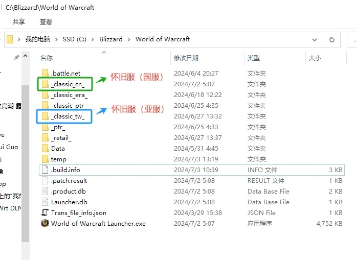

# WoWJunction

| [中文版](./README.md) | [English Version](./README.en.md) |

## 简介

魔兽世界怀旧服(国服/亚服)切换器（WoWJunction）

## 开源协议

[CC-BY-SA-4.0](./CC-BY-SA-4.0.cn.md)

## 原理

`软链接`（也称为 `符号链接`），是一个特殊的目录或文件，它是虚拟的，作用是把这个虚拟的目录或文件指向另一个真实的目录或文件。

而 `Windows` 上的 `NTFS` 文件格式也是支持类似 `Linux` 上的 `软链接` 功能的，`Windows` 叫做 `Reparse Point`（重解析点），而 `NTFS` 文件格式从 `Windows 7` 开始，已经基本普及了。

我们利用 `软链接` 功能，创建一个虚拟的《魔兽世界》怀旧服文件夹 `_classic_` ，让这个虚拟的文件夹指向真实的怀旧服（国服）文件夹 `_classic_cn_` 或者怀旧服（亚服）文件夹 `_classic_tw_`，来实现切换的目的。

## 软件名

`Windows` 上 `微软` 官方做一个管理目录软链接的工具 [Junction](https://learn.microsoft.com/zh-cn/sysinternals/downloads/junction)，中文叫 `交接点`，这也是本软件名 `WoWJunction` 的由来。本程序最早的代码，也是从搜索 “`微软 Junction`” 开始的，`codeproject` 上有人分享了一份源码：[Manipulating NTFS Junction Points in .NET](https://www.codeproject.com/Articles/15633/Manipulating-NTFS-Junction-Points-in-NET)，这是这个软件的核心代码。

## 依赖库

本软件是基于微软的 `.Net Framework v4.5.2`，采用 `C#` 编写的。`Windows 10`, `Windows 11` 都已经自带了，如果运行时显示 `.Net Framework` 的版本过低，请自行百度搜索最新版的 `.Net Framework` 安装即可，版本必须大于或等于 `v4.5.2`。

本人是 `C++` 程序员，理论上可以用 `C++` 重写该软件，但由于用 `C++` 重写耗费的时间较长，暂不考虑。

## 设置步骤

1. 首先，把《魔兽世界》游戏以及《战网》客户端都关闭，不关闭的话，修改文件夹名可能会失败；
2. 进入您的魔兽世界安装目录，例如：`C:\World of Warcraft`。

    * **如果你之前玩的是怀旧服（亚服）**

        1. 找到《魔兽世界》怀旧服的文件夹“`_classic_`”，将其更名为“`_classic_tw_`”；
        2. 改名完成后，将这个“`_classic_tw_`”目录复制一份，并粘贴到当前文件夹，并重名为“`_classic_cn_`”；

    * **如果你之前玩的是怀旧服（国服）**

        1. 找到《魔兽世界》怀旧服的文件夹“`_classic_`”，将其更名为“`_classic_cn_`”；
        2. 改名完成后，将这个“`_classic_cn_`”目录复制一份，并粘贴到当前文件夹，并重名为“`_classic_tw_`”；

3. 这样你就得到“`_classic_cn_`”，“`_classic_tw_`”两个文件夹，分别代表国服和亚服游戏目录。其中 `cn` 是中国的缩写，代表国服；`tw` 是台湾的缩写，代表亚服/台服。效果如下：

4. 至此，我们的准备工作就完成了。

## 使用说明

1. xxxx
2. xxxx
3. xxxx

## 作者

`作者`：郭子([gz_shines@msn.com](mailto:gz_shines@msn.com))

`国服`：一区 - 辛迪加 - 联盟 - 夏洛特（DK），司马云信丶（猎人）

`亚服`：全球服 - 逐风者 - 部落 - 夏洛特丷（DK），夏洛克丶（术士）

## Git 仓库

`Gitee`: [https://gitee.com/shines77/WoWJunction](https://gitee.com/shines77/WoWJunction)

`GitHub`: [https://github.com/shines77/WoWJunction](https://github.com/shines77/WoWJunction)

## 感谢

1. 感谢 [jeff.brown](https://www.codeproject.com/script/Membership/View.aspx?mid=1994253) 分享的源码：

[Manipulating NTFS Junction Points in .NET](https://www.codeproject.com/Articles/15633/Manipulating-NTFS-Junction-Points-in-NET)

2. 感谢 [walterlv - 吕毅](https://cloud.tencent.com/developer/column/71200) 分享的博客：

[.NET 实现 NTFS 文件系统的硬链接 mklink /J（Junction）](https://cloud.tencent.com/developer/article/2348956)

3. 感谢 `百度` 和 所有互联网分享 `C#` 代码的朋友。
